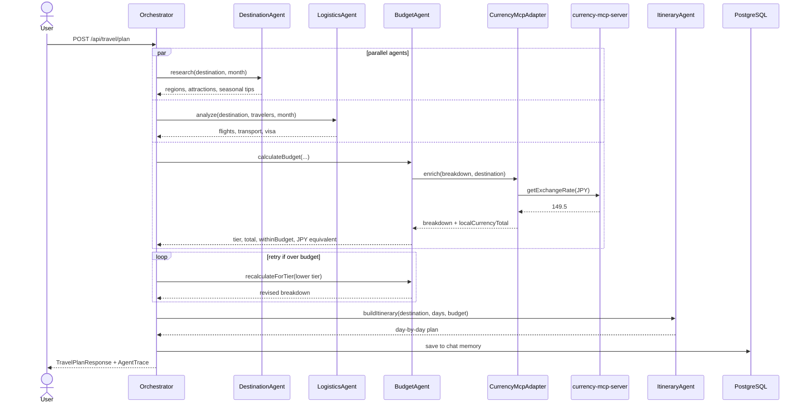

# Spring AI Advanced — Multi-Agent Travel Planner

A Spring AI showcase demonstrating **multi-agent orchestration**, **LangGraph human-in-the-loop workflows**, and **MCP client/server integration**, built on top of [springai-starter](../springai-starter).

**Tech stack:** Java 25 · Spring Boot 3.5 · Spring AI 1.1.4 · LangGraph4j 1.8.13 · PostgreSQL + pgvector · MCP · Docker Compose

---

## Quick Start

### Option A — Everything in Docker (recommended)

```bash
export OPENAI_API_KEY=sk-...
docker compose --profile app up --build
# App → http://localhost:8080
```

After the first run, skip re-ingestion on subsequent starts:
```properties
# application.properties
travel.agent.ingest-knowledge-base=false
```

### Option B — Database in Docker, app local (faster iteration)

```bash
docker compose up -d          # Postgres only
export OPENAI_API_KEY=sk-...
mvn spring-boot:run
```

### Option C — Use Anthropic Claude instead of OpenAI

```bash
export ANTHROPIC_API_KEY=sk-ant-...
export SPRING_AI_ACTIVE_MODEL=anthropic
docker compose --profile app up --build
```

> The embedding model always uses OpenAI (`text-embedding-3-small`) — only the chat agents switch to Anthropic.

---

## What This Project Adds Over the Starter

| Feature | springai-starter | springai-advanced |
|---|---|---|
| Vector store | `SimpleVectorStore` (in-memory, re-ingests every boot) | `PgVectorStore` with HNSW index (persists in Postgres) |
| Chat memory | `InMemoryChatMemoryRepository` (lost on restart) | `JdbcChatMemoryRepository` (survives restarts) |
| Tool calling | Single agent, one tool set | Each agent has its own `ChatClient` + tool set |
| Agent count | 1 monolithic service | 4 specialist agents + 1 orchestrator |
| Execution model | Sequential | Parallel `CompletableFuture` dispatch |
| Budget handling | None | ReAct loop — retries with lower tier if over budget |
| Observability | None | `AgentTrace` in every response |
| Infrastructure | None | Docker Compose (Postgres + pgvector) |
| External data | None | MCP client/server — live currency exchange rates |
| Workflow orchestration | None | LangGraph4j `StateGraph` — stateful, interruptible, resumable |
| Human-in-the-loop | None | Graph pauses for user approval before building itinerary |

---

## Features

### 1. Multi-Agent Orchestration with ReAct Budget Loop

The classic `/api/travel/plan` endpoint runs four specialist agents. Three of them execute in parallel, and the orchestrator retries the budget step automatically if the initial estimate is over budget.

**What happens when you send:** *"Plan 7 days in Japan in April for 4 people, $5000 budget"*

```
Step 1  OrchestratorAgent parses the query → typed TravelRequest
        (destination=Japan, days=7, travelers=4, budget=$5000, month=April)

Step 2  Three agents fire simultaneously via CompletableFuture:
        ├── DestinationResearchAgent  regions, attractions, April seasonal tips, RAG search
        ├── LogisticsAgent            flights (4 people, April surcharge), JR Pass, visa info
        └── BudgetAgent               cost breakdown → MID tier totals $6,400 → over budget

Step 3  ReAct retry loop:
        OBSERVE: $6,400 > $5,000  →  THINK: retry with BUDGET tier
        ACT: re-call BudgetAgent(BUDGET)  →  OBSERVE: $4,940 ✓

Step 4  ItineraryBuilderAgent builds a day-by-day plan at BUDGET tier

Step 5  Save to Postgres chat memory, return TravelPlanResponse + AgentTrace
```

Every step — including retries — appears in the `agentTrace` field:

```json
{
  "agentTrace": [
    { "step": "parse_query",          "durationMs": 312,  "parallel": false },
    { "step": "destination_research", "durationMs": 1840, "parallel": true  },
    { "step": "logistics",            "durationMs": 1720, "parallel": true  },
    { "step": "budget_mid",           "durationMs": 890,  "parallel": true, "retried": true },
    { "step": "budget_budget",        "durationMs": 780,  "parallel": false },
    { "step": "build_itinerary",      "durationMs": 2100, "parallel": false }
  ]
}
```

---

### 2. LangGraph Human-in-the-Loop

A second planning mode built on **LangGraph4j** that pauses mid-flow for user review — something the `ChatClient` pattern alone cannot express.

#### Graph topology

```
START
  → parse_query            LLM extracts structured TravelRequest from natural language
  → research_and_estimate  destination + logistics in parallel, then budget estimate
  → [INTERRUPT]            ← graph pauses; budget summary returned to caller
  → human_review           recalculates if user adjusted budget, otherwise pass-through
  → build_itinerary        full day-by-day itinerary
END
```

The `MemorySaver` checkpointer serialises the entire graph state keyed by `threadId`. When `/approve` or `/adjust` is called, the framework deserialises the checkpoint and resumes from `human_review` — nothing is recomputed.

#### API flow

```bash
# 1. Start — runs parse_query + research_and_estimate, then pauses
curl -X POST http://localhost:8080/api/graph/trips/start \
  -H "Content-Type: application/json" \
  -d '{"userQuery": "Plan 7 days in Japan for 2 people, budget $5000"}'
# → { "threadId": "abc-123", "destination": "Japan", "budgetEstimateUSD": 4850.0,
#     "budgetTier": "MID", "isWithinBudget": true, "message": "..." }

# 2a. Accept the budget → builds and returns the itinerary
curl -X POST http://localhost:8080/api/graph/trips/abc-123/approve

# 2b. Or adjust the budget first, then resume
curl -X POST http://localhost:8080/api/graph/trips/abc-123/adjust \
  -H "Content-Type: application/json" \
  -d '{"newBudgetUSD": 3500}'

# Inspect current state at any time without advancing the graph
curl http://localhost:8080/api/graph/trips/abc-123/status
```

#### LangGraph4j concepts demonstrated

| Concept | Where |
|---|---|
| `StateGraph` with typed `AgentState` | `TravelPlanningState` — all inter-node data as JSON strings |
| Node actions (`AsyncNodeAction`) | Each of the 4 nodes is an async lambda returning `Map<String, Object>` |
| `interruptBefore` | Graph pauses before `human_review`; state checkpointed to `MemorySaver` |
| `invoke(GraphInput.resume(), config)` | `/approve` resumes from the checkpoint without re-running earlier nodes |
| `updateState(config, Map, nodeId)` | `/adjust` injects `adjustedBudget` into the checkpoint before resuming |
| `getState(config)` | `/status` reads the checkpoint without advancing the graph |

A browser UI at `http://localhost:8080` (the **LangGraph Human-in-the-Loop** tab) lets you walk through the two-phase flow interactively.

---

### 3. MCP Currency Integration

Every budget response includes local-currency equivalents alongside the USD total:

```json
{
  "budgetBreakdown": {
    "grandTotal": 5007.0,
    "localCurrency": "JPY",
    "localCurrencyTotal": 748500,
    "exchangeRate": 149.5
  }
}
```

This is an **MCP client/server pair**:

- **`currency-mcp-server/`** — a standalone Spring Boot app on port 8090. Exposes one MCP tool (`getExchangeRate`) that calls `api.exchangerate-api.com` for live USD→target rates. No API key required.
- **Travel planner** — an MCP client. After calculating the USD breakdown, `BudgetAgent` calls `CurrencyMcpAdapter`, which fetches the live rate and enriches the `BudgetBreakdown`.

If the currency server is not running, the adapter falls back to static rates (JPY≈149.5, EUR≈0.92, THB≈35.8).

#### Running the currency server

```bash
# Terminal 1 — start the MCP server
cd currency-mcp-server && mvn spring-boot:run
# Listens on http://localhost:8090, MCP SSE at /sse

# Terminal 2 — enable live rates in the travel planner
# Uncomment in application.properties:
# spring.ai.mcp.client.sse.connections.currency-server.url=http://localhost:8090
mvn spring-boot:run
```

---

### 4. Persistent Memory

#### JDBC Chat Memory

Conversations are stored in Postgres (`spring_ai_chat_memory` table) keyed by `conversationId`. Follow-up requests have full context even after a restart:

```bash
# Turn 1
curl -X POST http://localhost:8080/api/travel/plan \
  -H "Content-Type: application/json" \
  -d '{"userQuery": "Plan 7 days in Japan in April for 4 people, budget $5000"}'
# → { "conversationId": "abc-123", ... }

# Turn 2 — the orchestrator knows it's Japan, knows day 3
curl -X POST http://localhost:8080/api/travel/followup \
  -H "Content-Type: application/json" \
  -d '{"userQuery": "Make day 3 a food tour", "conversationId": "abc-123"}'

# Turn 3 — knows the current budget tier
curl -X POST http://localhost:8080/api/travel/followup \
  -H "Content-Type: application/json" \
  -d '{"userQuery": "Make it more budget-friendly", "conversationId": "abc-123"}'
```

#### PgVectorStore

Destination knowledge is embedded once and stored permanently with an HNSW index. `DestinationResearchAgent` runs semantic search over it at query time.

| Aspect | springai-starter | springai-advanced |
|---|---|---|
| Storage | In-memory, re-ingested every boot | Postgres, ingested once |
| Index | Linear scan | HNSW approximate nearest-neighbour |
| Persistence | Lost on restart | Survives restarts |

---

## Architecture



---

## The Five Agents

| Agent | Role | Key Spring AI feature |
|---|---|---|
| `OrchestratorAgent` | Parses query, dispatches agents in parallel, runs budget retry loop, assembles response | `CompletableFuture`, `JdbcChatMemoryRepository` |
| `DestinationResearchAgent` | Regions, attractions, seasonal tips, RAG search | Own `ChatClient`, PgVectorStore semantic search |
| `LogisticsAgent` | Flights (with seasonal multipliers), transport options, visa requirements | Own `ChatClient`, `@Tool` methods |
| `BudgetAgent` | Cost breakdown, tier selection, local-currency enrichment | No LLM — pure logic + `CurrencyMcpAdapter` |
| `ItineraryBuilderAgent` | Groups attractions by neighbourhood, picks restaurants, builds `List<DayPlan>` | Structured output via `.entity()` |

---

## API Reference

### Classic multi-agent flow

| Method | Endpoint | Description |
|---|---|---|
| `GET` | `/api/travel/info` | Service info, supported destinations, feature list |
| `GET` | `/api/travel/destinations` | List supported destinations |
| `POST` | `/api/travel/plan` | Plan a trip from a natural language query |
| `POST` | `/api/travel/followup` | Follow-up on an existing plan (requires `conversationId`) |
| `GET` | `/api/travel/plan/quick?query=...` | Quick plan via query param |

**POST /api/travel/plan**

```bash
curl -X POST http://localhost:8080/api/travel/plan \
  -H "Content-Type: application/json" \
  -d '{
    "userQuery": "Plan a 7-day trip to Japan in April for a family of 4 with a $5000 budget",
    "conversationId": ""
  }' | jq .
```

Response: `conversationId`, `travelPlan` (dayPlans, budgetBreakdown, logisticsResult, culturalTips), `agentTrace`.

### LangGraph human-in-the-loop flow

| Method | Endpoint | Description |
|---|---|---|
| `POST` | `/api/graph/trips/start` | Start the graph — runs to budget estimate, pauses. Returns `threadId` + budget summary. |
| `POST` | `/api/graph/trips/{threadId}/approve` | Resume with original budget — builds and returns itinerary. |
| `POST` | `/api/graph/trips/{threadId}/adjust` | Inject adjusted budget `{"newBudgetUSD": 3500}`, recalculate, build itinerary. |
| `GET` | `/api/graph/trips/{threadId}/status` | Inspect current graph state without advancing. |

---

## Supported Destinations

| Destination | Cities / Regions |
|---|---|
| Japan | Tokyo, Kyoto, Osaka |
| France | Paris |
| Italy | Rome, Florence |
| Thailand | Bangkok, Chiang Mai, Phuket / Krabi |
| Spain | Barcelona |

All destination data (attractions, seasonal tips, cultural advice, cost estimates, transport options, visa requirements) is static — the focus is AI orchestration patterns, not live booking.

---

## Project Structure

```
springai-advanced/                        ← travel planner (port 8080)
src/main/java/com/example/travelplanner/
├── agent/
│   ├── OrchestratorAgent.java            # Parallel dispatch, ReAct budget loop, JDBC memory
│   ├── DestinationResearchAgent.java     # Regions, attractions, seasonal tips, RAG
│   ├── LogisticsAgent.java               # Flights, transport, visa
│   ├── BudgetAgent.java                  # Cost breakdown, tier selection, currency enrichment
│   └── ItineraryBuilderAgent.java        # Day-by-day plan, structured output
├── tools/
│   ├── DestinationTools.java             # @Tool methods backed by data + PgVectorStore
│   ├── LogisticsTools.java               # @Tool methods for flights, transport, visa
│   ├── BudgetTools.java                  # @Tool methods for cost calculations
│   ├── CurrencyMcpAdapter.java           # MCP client — calls currency server, falls back to static
│   └── ItineraryTools.java               # @Tool methods for neighbourhoods, restaurants
├── graph/                                # LangGraph4j human-in-the-loop flow
│   ├── TravelPlanningState.java          # AgentState with typed accessors over the state map
│   ├── TravelPlanningGraph.java          # StateGraph: 4 nodes + MemorySaver checkpointer
│   ├── GraphTravelController.java        # /start, /approve, /adjust, /status endpoints
│   └── model/                            # TripStartResponse, BudgetAdjustRequest, GraphTripPlanResponse
├── data/
│   ├── DestinationDataRepository.java    # Loads 5 destination JSON files
│   ├── BudgetDataRepository.java         # Accommodation rates, meal costs
│   └── LogisticsDataRepository.java      # Flight estimates, transport, visa
├── config/AgentConfig.java               # ChatModel selector, executor, JDBC memory bean
├── init/KnowledgeBaseInitializer.java    # Ingests destinations into PgVectorStore on startup
├── controller/TravelController.java      # REST endpoints (classic flow)
└── model/                                # Records: TravelPlan, DayPlan, BudgetBreakdown, AgentTrace, …

currency-mcp-server/                      ← companion MCP server (port 8090)
src/main/java/com/example/currency/
├── CurrencyMcpServerApplication.java     # Registers CurrencyService as MCP ToolCallbackProvider
└── CurrencyService.java                  # @Tool getExchangeRate — calls exchangerate-api.com

src/main/resources/
├── application.properties
├── db/init.sql                           # pgvector extension + chat memory table DDL
├── static/index.html                     # Browser demo UI
└── data/
    ├── destinations/                     # japan.json, france-paris.json, italy.json, …
    ├── budget/                           # accommodation-rates.json, meal-costs.json
    └── logistics/                        # flight-estimates.json, transport-options.json, visa-requirements.json
```

---

## Running Tests

No LLM calls required — all tests use mocked/static data:

```bash
# Travel planner (54 tests)
mvn test

# Currency MCP server (6 tests)
cd currency-mcp-server && mvn test
```

| Test class | Count | What it covers |
|---|---|---|
| `BudgetToolsTest` | 8 | Tier selection, cost maths, seasonal flight surcharges |
| `BudgetAgentTest` | 8 | Retry loop, tier ordering, JPY/EUR currency enrichment |
| `CurrencyMcpAdapterTest` | 11 | Destination→currency mapping, fallback rates, field preservation |
| `DestinationDataRepositoryTest` | 13 | All 5 destinations, edge cases |
| `BudgetDataRepositoryTest` | 8 | Rate hierarchy, unknown destinations |
| `TravelControllerTest` | 6 | MockMvc — all REST endpoints |
| `CurrencyServiceTest` | 6 | Rate lookup, case insensitivity, unknown currency fallback |

---

## Useful Docker Commands

```bash
# Container status
docker compose ps

# Follow app logs
docker compose --profile app logs -f app

# Connect to Postgres
docker exec -it travel-planner-postgres psql -U traveluser -d travelplanner

# Count stored vectors
docker exec -it travel-planner-postgres psql -U traveluser -d travelplanner \
  -c "SELECT count(*) FROM vector_store;"

# Inspect chat memory
docker exec -it travel-planner-postgres psql -U traveluser -d travelplanner \
  -c "SELECT conversation_id, count(*) FROM spring_ai_chat_memory GROUP BY 1;"

# Stop and wipe (forces fresh knowledge base ingestion on next start)
docker compose --profile app down -v
```

---

## Prerequisites

- Docker and Docker Compose
- An OpenAI API key (`OPENAI_API_KEY`) or Anthropic key (`ANTHROPIC_API_KEY`)
- Java 25 + Maven (only needed if running outside Docker)
