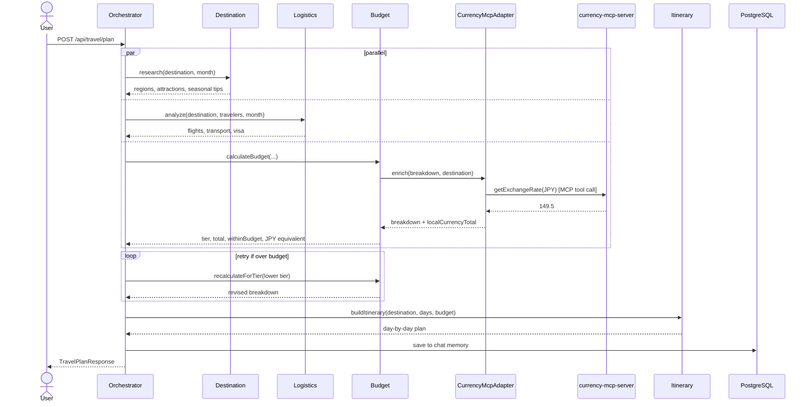

# Spring AI Advanced — Multi-Agent Travel Itinerary Planner

An advanced Spring AI showcase demonstrating **multi-agent orchestration** and **LangGraph human-in-the-loop workflows**, built as a companion to [springai-starter](../springai-starter). Where the starter covers the fundamentals (chat, streaming, RAG, tool calling, MCP), this project goes deeper — multiple specialised AI agents working in parallel, persistent memory across restarts, a production-grade vector store, and a stateful interruptible graph built with LangGraph4j.

**Tech stack:** Java 25 · Spring Boot 3.5 · Spring AI 1.1.4 · LangGraph4j 1.8.13 · PostgreSQL + pgvector · MCP client/server · Docker Compose

---

## What this project showcases

| Feature | springai-starter | springai-advanced |
|---|---|---|
| Vector store | `SimpleVectorStore` (in-memory, re-ingests on every boot) | `PgVectorStore` with HNSW index (persists in Postgres) |
| Chat memory | `InMemoryChatMemoryRepository` (lost on restart) | `JdbcChatMemoryRepository` (survives restarts) |
| Tool calling | Single agent calls one tool | Each agent has its own `ChatClient` + tool set |
| Agent count | 1 monolithic service | 4 specialist agents + 1 orchestrator |
| Execution model | Sequential | Parallel `CompletableFuture` dispatch |
| Budget handling | None | ReAct loop — retries with lower tier if over budget |
| Observability | None | `AgentTrace` in every response shows every step |
| Infrastructure | None | Docker Compose (Postgres + pgvector) |
| External data | None | MCP client/server — live currency exchange rates |
| Workflow orchestration | None | LangGraph4j `StateGraph` — stateful, interruptible, resumable |
| Human-in-the-loop | None | Graph pauses mid-flow for user approval before building itinerary |

---

## LangGraph Human-in-the-Loop Flow

The project includes a second planning mode built on **LangGraph4j** that demonstrates stateful, interruptible agent graphs — something Spring AI's `ChatClient` pattern alone cannot express.

### The problem it solves

The classic `/api/travel/plan` endpoint is fully automated: all agents run and the finished itinerary is returned in one call. There's no way to inspect the budget estimate mid-flight and decide whether to proceed. With LangGraph4j, the same agents are wired into a `StateGraph` that can **pause at a defined node, checkpoint its state, and resume later**.

### Graph topology

```
START
  → parse_query            LLM parses "7 days Japan $5000" → typed TravelRequest
  → research_and_estimate  destination + logistics in parallel, then budget estimate
  → [INTERRUPT]            ← graph pauses; budget summary returned to caller
  → human_review           recalculates budget if user adjusted, otherwise pass-through
  → build_itinerary        full day-by-day itinerary
END
```

The `MemorySaver` checkpointer serialises the entire graph state (keyed by `threadId`) at the interruption point. When the user calls `/approve` or `/adjust`, the framework deserialises the checkpoint and continues from `human_review` — nothing is re-computed.

### API flow

```bash
# 1. Start — graph runs parse_query + research_and_estimate, then pauses
curl -X POST http://localhost:8080/api/graph/trips/start \
  -H "Content-Type: application/json" \
  -d '{"userQuery": "Plan 7 days in Japan for 2 people, budget $5000"}'
# → { "threadId": "abc-123", "destination": "Japan", "budgetEstimateUSD": 4850.0,
#     "budgetTier": "MID", "isWithinBudget": true, "message": "..." }

# 2a. Accept the budget — graph resumes and builds the itinerary
curl -X POST http://localhost:8080/api/graph/trips/abc-123/approve

# 2b. Or adjust the budget first — graph injects new value, recalculates, builds
curl -X POST http://localhost:8080/api/graph/trips/abc-123/adjust \
  -H "Content-Type: application/json" \
  -d '{"newBudgetUSD": 3500}'

# Inspect current graph state at any time (which node is next, what's been computed)
curl http://localhost:8080/api/graph/trips/abc-123/status
```

### Key LangGraph4j concepts demonstrated

| Concept | Where it appears |
|---|---|
| `StateGraph` with typed `AgentState` | `TravelPlanningState` holds all inter-node data as JSON strings |
| Node actions (`AsyncNodeAction`) | Each of the 4 nodes is an async lambda returning `Map<String, Object>` updates |
| `interruptBefore` | Graph pauses before `human_review`; state is checkpointed to `MemorySaver` |
| `invoke(GraphInput.resume(), config)` | `/approve` resumes from the saved checkpoint without re-running earlier nodes |
| `updateState(config, Map, nodeId)` | `/adjust` injects `adjustedBudget` into the checkpoint before resuming |
| `getState(config)` | `/status` reads the current checkpoint without advancing the graph |

### UI demo

Switch to the **LangGraph Human-in-the-Loop** tab in the browser UI at `http://localhost:8080`. The two-phase flow — budget preview → approve/adjust → final itinerary — is fully interactive.

---

## MCP Currency Feature

The `BudgetBreakdown` in every plan response now includes three extra fields:

| Field | Example |
|---|---|
| `localCurrency` | `"JPY"` |
| `localCurrencyTotal` | `748500` |
| `exchangeRate` | `149.5` |

So the total cost is shown as both `"grandTotal": 5007.0` (USD) **and** `"localCurrencyTotal": 748500` (JPY, at the live rate).

This is implemented as an **MCP client/server pair** that communicates across process boundaries:

- **`currency-mcp-server/`** — a standalone Spring Boot app running on port 8090. It exposes one MCP tool (`getExchangeRate`) that calls `api.exchangerate-api.com/v4/latest/USD` and returns the live USD→target rate. No API key required.
- **Travel planner** — an MCP client. After calculating the USD budget breakdown, `BudgetAgent` calls the MCP server via `CurrencyMcpAdapter` to get the live rate, then enriches the `BudgetBreakdown`.

If the currency server is not running, the adapter falls back to static rates (JPY≈149.5, EUR≈0.92, THB≈35.8) so the travel planner always works.

### Running the Currency MCP Server

```bash
# Terminal 1 — start the currency MCP server
cd currency-mcp-server
mvn spring-boot:run
# Listens on http://localhost:8090, MCP SSE endpoint at /sse

# Terminal 2 — enable live rates in the travel planner
# Uncomment in src/main/resources/application.properties:
# spring.ai.mcp.client.sse.connections.currency-server.url=http://localhost:8090

# Then start the travel planner as usual
mvn spring-boot:run
```

The MCP server exposes one tool named `getExchangeRate`. You can inspect it at `GET http://localhost:8090/sse`.

---

## Architecture



---

## Request Flow — Plain English

Here is exactly what happens when you send:
> *"Plan a 7-day trip to Japan in April for a family of 4 with a $5000 budget"*

**Step 1 — Parse the query**
The `OrchestratorAgent` receives the natural language query and uses a lightweight LLM call with structured output to extract the key fields: destination (`Japan`), duration (`7 days`), travellers (`4`), budget (`$5000`), and month (`April`). This becomes a typed `TravelRequest` object that the rest of the system works with.

**Step 2 — Three agents run at the same time**
The orchestrator fires three specialist agents simultaneously using `CompletableFuture`, so all three run in parallel rather than one after another:

- The **DestinationResearchAgent** looks up Japan's regions, must-see attractions, what April is like (cherry blossom season, very crowded), cultural tips, and neighbourhood groupings. It also runs a semantic search against the PgVectorStore knowledge base to pull in any relevant context.
- The **LogisticsAgent** fetches round-trip flight estimates for 4 people (with the April seasonal surcharge applied), all local transport options like the JR Pass and Suica IC card, and confirms there's no visa required for US passport holders.
- The **BudgetAgent** calculates a full cost breakdown — flights, accommodation per night, meals per day per person, activities, local transport, and a buffer — then picks the highest tier (LUXURY → MID → BUDGET) that fits within $5000.

The orchestrator waits for all three to complete before moving on.

**Step 3 — Budget validation loop**
Once the budget breakdown arrives, the orchestrator checks whether the grand total is within the $5000 limit. In this example, a MID-tier plan totals around $6,400 — over budget. The orchestrator automatically re-calls the `BudgetAgent` asking it to recalculate for the BUDGET tier instead. The new total comes in at around $4,900, which fits. This retry loop runs up to two times before giving up and going with whatever is closest.

**Step 4 — Build the itinerary**
With the destination research and confirmed budget tier in hand, the orchestrator calls the `ItineraryBuilderAgent`. This agent groups geographically close attractions into the same day (so you're not criss-crossing the city unnecessarily), picks restaurants that match the budget tier, and builds a day-by-day plan. It returns a structured `List<DayPlan>` — each day has a theme, morning/afternoon/evening activities, lunch and dinner picks, accommodation area, and estimated daily spend.

**Step 5 — Save and respond**
The orchestrator saves a summary of the plan to the `spring_ai_chat_memory` table in Postgres, keyed by the `conversationId`. This means follow-up requests like *"make day 3 a food tour"* or *"what should we pack?"* will automatically have the full context of this plan, even if the application has restarted since. Finally, the complete `TravelPlanResponse` is returned — including the plan itself and an `AgentTrace` that shows every agent call, whether it ran in parallel, how long it took, and whether any budget retries occurred.

---

## The Five Agents

### OrchestratorAgent
The coordinator. It receives the raw user query, parses it into a structured `TravelRequest`, fires the three specialist agents in parallel, validates the budget (retrying with a lower tier if over budget), then calls the itinerary builder and assembles the final `TravelPlan`.

It also holds the **JDBC chat memory** — every conversation is stored by `conversationId`, so follow-up requests like *"make day 3 a food tour"* have full context from the previous plan.

### DestinationResearchAgent
A travel researcher. Has its own `ChatClient` and four `@Tool`-annotated methods: regions, must-see attractions, seasonal tips, and a **PgVectorStore semantic search** over the destination knowledge base.

### LogisticsAgent
A logistics specialist. Uses tools to look up round-trip flight estimates (with seasonal multipliers), local transport options (JR Pass, metro, IC cards), and visa requirements for US passport holders.

### BudgetAgent
A budget analyst. Pure logic — no LLM call. Calculates a full cost breakdown across flights, accommodation, meals, activities, and transport. Determines the appropriate tier (BUDGET / MID / LUXURY) and flags whether the total is within the user's budget. After calculating the USD breakdown, delegates to `CurrencyMcpAdapter` to fetch the live exchange rate and add a local-currency equivalent (e.g. ¥748,500 ≈ $5,007 USD).

### ItineraryBuilderAgent
The day planner. Groups geographically close attractions into the same day using neighbourhood data, picks budget-appropriate restaurants, and returns a structured `List<DayPlan>` via Spring AI's `.entity()` structured output.

---

## The ReAct Budget Loop

One of the key things this project demonstrates is a **multi-step reasoning loop** in the orchestrator:

```
THINK  →  I need destination research, logistics, and a budget breakdown.
ACT    →  Fire DestinationResearchAgent, LogisticsAgent, BudgetAgent in parallel.
OBSERVE → Budget breakdown: MID tier totals $6,398. Budget is $5,000. Over by $1,398.
THINK  →  I need to retry with a lower tier.
ACT    →  Re-call BudgetAgent with BUDGET tier.
OBSERVE → BUDGET tier totals $4,940. Within budget.
ACT    →  Call ItineraryBuilderAgent with the BUDGET tier breakdown.
OBSERVE → 7 DayPlans returned.
SYNTHESISE → Assemble TravelPlan. Record all steps in AgentTrace.
```

Every step — including the retry — appears in the `agentTrace` field of the response, making the reasoning fully visible.

---

## Multi-Turn Follow-Ups

The `JdbcChatMemoryRepository` persists conversations to Postgres. This enables follow-up requests that reference the previous plan:

```bash
# Turn 1 — plan the trip
curl -X POST http://localhost:8080/api/travel/plan \
  -H "Content-Type: application/json" \
  -d '{"userQuery": "Plan 7 days in Japan in April for 4 people, budget $5000"}'
# → returns conversationId: "abc-123", full TravelPlan

# Turn 2 — refine it (same conversationId)
curl -X POST http://localhost:8080/api/travel/followup \
  -H "Content-Type: application/json" \
  -d '{"userQuery": "Make day 3 a food tour", "conversationId": "abc-123"}'
# → orchestrator loads history, knows it's Japan, knows current day 3, patches it

# Turn 3 — adjust budget
curl -X POST http://localhost:8080/api/travel/followup \
  -H "Content-Type: application/json" \
  -d '{"userQuery": "Make it more budget-friendly", "conversationId": "abc-123"}'
# → orchestrator knows the current tier and reprices accordingly
```

Without `JdbcChatMemoryRepository`, turn 2 would have no idea what "day 3" refers to. The memory is stored in Postgres, so it survives application restarts — unlike the in-memory alternative used in springai-starter.

---

## PgVectorStore vs SimpleVectorStore

The starter uses `SimpleVectorStore`, which re-ingests all documents on every application startup and keeps everything in RAM. This project uses `PgVectorStore`:

- Embeddings are stored permanently in Postgres with an **HNSW index** for fast approximate nearest-neighbour search
- The knowledge base is only ingested **once** — set `travel.agent.ingest-knowledge-base=false` after the first run
- Semantic search uses cosine distance with configurable `topK` and score thresholds
- The same Postgres container serves both the vector store and JDBC chat memory

---

## Prerequisites

- Docker and Docker Compose
- An OpenAI API key (`OPENAI_API_KEY`) — or an Anthropic key if using Claude
- Java 25 + Maven (only needed if running outside Docker)

---

## Quick Start

### Everything in Docker (recommended)

```bash
# Clone and enter the project
cd springai-advanced

# Set your API key
export OPENAI_API_KEY=sk-...

# Build and start (first run takes ~2 min while Maven downloads dependencies)
docker compose --profile app up --build

# App is ready at http://localhost:8080
```

After the first run, knowledge base ingestion has populated PgVectorStore. Set this in `application.properties` to skip re-ingestion on subsequent starts:
```properties
travel.agent.ingest-knowledge-base=false
```

### Database only in Docker (development)

Run Postgres in Docker, the Spring Boot app locally — faster iteration:

```bash
docker compose up -d          # start Postgres only
export OPENAI_API_KEY=sk-...
mvn spring-boot:run
```

### Switch to Anthropic Claude

```bash
export ANTHROPIC_API_KEY=sk-ant-...
export SPRING_AI_ACTIVE_MODEL=anthropic
docker compose --profile app up --build
```

The embedding model always uses OpenAI (`text-embedding-3-small`) — Anthropic has no embedding model. Only the chat agents switch.

---

## Useful Docker Commands

```bash
# Check container status
docker compose ps

# Watch app logs
docker compose --profile app logs -f app

# Connect to Postgres
docker exec -it travel-planner-postgres psql -U traveluser -d travelplanner

# How many vectors are stored?
docker exec -it travel-planner-postgres psql -U traveluser -d travelplanner \
  -c "SELECT count(*) FROM vector_store;"

# Inspect chat memory
docker exec -it travel-planner-postgres psql -U traveluser -d travelplanner \
  -c "SELECT conversation_id, count(*) FROM spring_ai_chat_memory GROUP BY 1;"

# Stop and wipe everything (forces fresh knowledge base ingestion on next start)
docker compose --profile app down -v
```

---

## API Endpoints

**Classic multi-agent flow:**

| Method | Endpoint | Description |
|---|---|---|
| `GET` | `/api/travel/info` | Service info, supported destinations, feature list |
| `GET` | `/api/travel/destinations` | List of supported destinations |
| `POST` | `/api/travel/plan` | Plan a new trip from a natural language query |
| `POST` | `/api/travel/followup` | Follow-up on an existing plan (requires `conversationId`) |
| `GET` | `/api/travel/plan/quick?query=...` | Quick plan via query param (for browser/curl testing) |

**LangGraph human-in-the-loop flow:**

| Method | Endpoint | Description |
|---|---|---|
| `POST` | `/api/graph/trips/start` | Start the graph — runs to budget estimate, then pauses. Returns `threadId` + budget summary. |
| `POST` | `/api/graph/trips/{threadId}/approve` | Resume graph with original budget — builds and returns itinerary. |
| `POST` | `/api/graph/trips/{threadId}/adjust` | Inject adjusted budget (`{"newBudgetUSD": 3500}`), resume — recalculates and builds itinerary. |
| `GET` | `/api/graph/trips/{threadId}/status` | Inspect current graph state (next node, what has been computed) without advancing. |

### POST /api/travel/plan

```json
{
  "userQuery": "Plan a 7-day trip to Japan in April for a family of 4 with a $5000 budget",
  "conversationId": "optional-leave-blank-for-new"
}
```

Response includes: `conversationId`, `travelPlan` (with `dayPlans`, `budgetBreakdown`, `logisticsResult`, `culturalTips`), and `agentTrace` (every agent step, parallel batch, budget retries, durations).

### Sample curl

```bash
curl -X POST http://localhost:8080/api/travel/plan \
  -H "Content-Type: application/json" \
  -d '{
    "userQuery": "Plan a 7-day trip to Japan in April for a family of 4 with a $5000 budget"
  }' | jq .
```

---

## Supported Destinations

- **Japan** (Tokyo, Kyoto, Osaka)
- **France** — Paris
- **Italy** — Rome & Florence
- **Thailand** (Bangkok, Chiang Mai, Phuket/Krabi)
- **Spain** — Barcelona

All destination data (attractions, seasonal tips, cultural advice, neighbourhood groupings, cost estimates, transport options, visa requirements) is static/simulated — no live APIs are called. The focus is on the AI orchestration patterns, not real-world booking.

---

## Project Structure

```
springai-advanced/                   ← travel planner (Spring Boot, port 8080)
src/main/java/com/example/travelplanner/
├── agent/
│   ├── OrchestratorAgent.java       # Parallel dispatch, budget loop, JDBC memory
│   ├── DestinationResearchAgent.java # Regions, attractions, seasonal tips, RAG
│   ├── LogisticsAgent.java          # Flights, transport, visa
│   ├── BudgetAgent.java             # Cost breakdown, tier selection, currency enrichment
│   └── ItineraryBuilderAgent.java   # Day-by-day plan, structured output
├── tools/
│   ├── DestinationTools.java        # @Tool methods backed by data + PgVectorStore
│   ├── LogisticsTools.java          # @Tool methods for flights, transport, visa
│   ├── BudgetTools.java             # @Tool methods for cost calculations
│   ├── CurrencyMcpAdapter.java      # MCP client — calls currency server, falls back to static rates
│   └── ItineraryTools.java          # @Tool methods for neighbourhoods, restaurants
├── data/
│   ├── DestinationDataRepository.java # Loads 5 destination JSON files
│   ├── BudgetDataRepository.java      # Accommodation rates, meal costs
│   └── LogisticsDataRepository.java   # Flight estimates, transport, visa
├── config/
│   └── AgentConfig.java             # ChatModel selector, executor, JDBC memory bean
├── init/
│   └── KnowledgeBaseInitializer.java # Ingests destinations into PgVectorStore on startup
├── controller/
│   └── TravelController.java        # REST endpoints (classic flow)
├── graph/                           # LangGraph4j human-in-the-loop flow (new — no existing files modified)
│   ├── TravelPlanningState.java     # AgentState subclass — typed accessors over the shared state map
│   ├── TravelPlanningGraph.java     # @Configuration — StateGraph with 4 nodes + MemorySaver checkpointer
│   ├── GraphTravelController.java   # REST endpoints: /start, /approve, /adjust, /status
│   └── model/
│       ├── TripStartResponse.java   # Returned by /start — threadId + budget summary
│       ├── BudgetAdjustRequest.java # Request body for /adjust
│       └── GraphTripPlanResponse.java # Final response after approve/adjust
└── model/                           # Java records: TravelPlan, DayPlan, BudgetBreakdown, AgentTrace, …

currency-mcp-server/                 ← companion MCP server (Spring Boot, port 8090)
src/main/java/com/example/currency/
├── CurrencyMcpServerApplication.java  # Registers CurrencyService as MCP ToolCallbackProvider
└── CurrencyService.java               # @Tool getExchangeRate — calls api.exchangerate-api.com

src/main/resources/
├── application.properties
├── db/init.sql                      # pgvector extension + chat memory table DDL
├── static/index.html                # Browser demo UI
└── data/
    ├── destinations/                # japan.json, france-paris.json, italy.json, …
    ├── budget/                      # accommodation-rates.json, meal-costs.json
    └── logistics/                   # flight-estimates.json, transport-options.json, visa-requirements.json
```

---

## Running the Tests

Tests cover all data loading, budget calculations, and REST endpoints — no LLM calls required:

```bash
mvn test
```

```
BudgetToolsTest                8 tests  — tier selection, cost maths, seasonal flight surcharges
BudgetAgentTest                8 tests  — retry loop, tier ordering, JPY/EUR currency enrichment
CurrencyMcpAdapterTest        11 tests  — destination→currency mapping, fallback rates, field preservation
DestinationDataRepositoryTest 13 tests  — all 5 destinations, edge cases
BudgetDataRepositoryTest       8 tests  — rate hierarchy, unknown destinations
TravelControllerTest           6 tests  — MockMvc, all endpoints

Travel planner total: 54 tests, 0 failures

CurrencyServiceTest  (currency-mcp-server)
                       6 tests  — rate lookup, case insensitivity, unknown currency fallback
```

Run tests for each module separately:

```bash
# Travel planner
mvn test

# Currency MCP server
cd currency-mcp-server && mvn test
```
